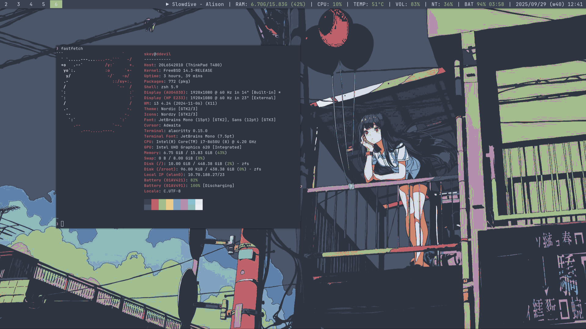

# FreeBSD 14 (ThinkPad T480) | i3wm Dotfiles

A clean, fast, and power‑efficient FreeBSD desktop tailored for the ThinkPad T480. This setup pairs i3wm with a cohesive Nord theme, hardware acceleration for Intel graphics, laptop‑friendly power management, and a practical i3status bar driven by a helper script.

## Key Features

- ThinkPad T480 optimized: Intel UHD 620 acceleration, Wi‑Fi (Intel 8265), TrackPoint/TouchPad, ACPI/ThinkPad extras
- Smart laptop power: CPU frequency scaling via powerdxx, aggressive PCI power saving, thermal sensors, and lid-close suspend (S3)
- Opinionated security + performance: restrictive sysctls, ZFS tuning (ARC cap, ashift=12), larger TCP buffers, IPv4-preferred networking with per-interface IPv6, CUBIC congestion control, GELI disk encryption
- i3wm workflow: sensible gaps, vim‑style focus/move, scratchpad, quick screenshots, and multi‑monitor helpers
- Nordic theme everywhere: consistent Nord palette for i3, rofi, alacritty, dunst, and GTK (Nordic theme included)
- Informative status bar: media, RAM, CPU usage, CPU temperature, volume, brightness, battery, date/time via i3status + helper
- Essentials included: Wi‑Fi reconnect script, notifications, compositor, screenshot tool and clipboard manager wired into the session

## Hardware
- ThinkPad T480

## Operating System
- FreeBSD 14.x (amd64)

## Software Stack
- Window Manager: i3 (with gaps)
- Status Bar: i3status + helper script
- Terminal: Alacritty
- Launcher: Rofi
- Notifications: Dunst

## Dependencies / Prerequisites

Install via pkg (adjust as needed):
- Core desktop: xorg, xinit, i3, i3status, i3lock, rofi, dunst, picom, feh, scrot
- Terminal/fonts: alacritty, jetbrains-mono, font-awesome, nerd-fonts (optional)
- Graphics/Wi‑Fi: drm-kmod (i915kms), webcamd (for camera), playerctl (media keys)
- Audio: pulseaudio (pactl) or pipewire + wireplumber + pipewire-pulse
- Utilities: git, bash/zsh, doas, clipmenu (clipmenud), powerdxx, xidle, xbacklight

Notes:
- Add your user to the video group for graphics/backlight access.
- Wi‑Fi driver/firmware (iwm + 8265fw) and i915kms load through `rc.conf`'s `kld_list`, keeping `loader.conf` lean.
- HDA audio latency is nudged to `hw.snd.latency=4` so brief pops calm down without adding noticeable delay.
- This setup ships with powerdxx enabled (and base powerd disabled) for smoother CPU scaling on laptops.

## Wi‑Fi notes

I use FreeBSD's `ifconfig` and `wpa_supplicant` stack instead of additional network managers, so this setup keeps things lightweight by skipping GUI network managers. Populate `/etc/wpa_supplicant.conf` with the networks you care about and let the wifi-reconnect.sh script reconnect for you. A sample configuration with a few common scenarios looks like this:

```conf
ctrl_interface=/var/run/wpa_supplicant
eapol_version=2
ap_scan=1
fast_reauth=1

# Optional catch-all for completely open networks.
# network={
#   key_mgmt=NONE
#   priority=0
# }

# Typical WPA2/WPA3 PSK home network.
network={
	ssid="HomeLab_5G"
	key_mgmt=WPA-PSK
	psk="passphrase"
	priority=10
}

# Hidden SSID that still uses WPA2-PSK (scan_ssid forces active probing).
network={
	ssid="HiddenIoT"
	scan_ssid=1
	key_mgmt=WPA-PSK
	psk="passphrase"
	priority=5
}

# Enterprise/EAP deployment (e.g., campus Wi-Fi).
network={
	ssid="CampusNet"
	scan_ssid=1
	key_mgmt=WPA-EAP
	eap=PEAP
	identity="username@example.edu"
	password="account-secret"
	phase1="peaplabel=0"
	phase2="auth=MSCHAPV2"
	priority=7
}
```

**Tips:**

- Comment out or delete networks you no longer want to join before adding new ones. Keeping only the desired blocks helps `wpa_supplicant` choose the right SSID quickly.
- After updating the file, run the Wi‑Fi reconnect helper (`system_config_files/wifi-reconnect.sh`). With `doas` configured you can refresh the link in one line: `doas ./wifi-reconnect.sh wlan0`. Omit the interface argument to fall back to the script's defaults.
- The script restarts `wpa_supplicant` and `dhclient`, so you can switch networks without rebooting. Make sure the configuration file path (`/etc/wpa_supplicant.conf` unless you pass a different one) is accurate.

## Screenshots




## Installation

See the **INSTALL.md** guide for step‑by‑step instructions.
